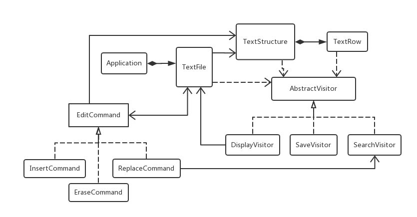
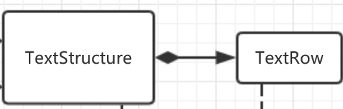
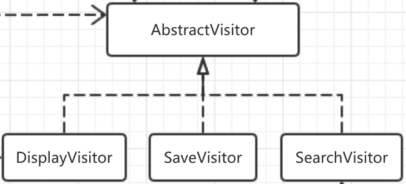
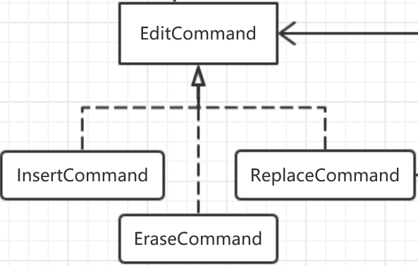
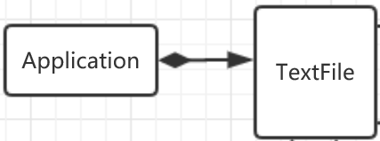

# 总体方案设计说明
#### Encoded in UTF-8

# 1. 软件开发环境
* IDE: Qt Creator 4.5.1
* QT库版本: 5.10.1
* 编译器: MSVC 2017 64bit
* 项目类型: Qt Quick Application
* 编程语言: C++/QML
* 版本管理工具: Git
* 文档编写语言: Markdown
* 文档编辑器: Visual Studio Code

# 2. 架构

## 3.1 层次
总体上分为UI(用户交互界面)和底层逻辑两部分。UI及相关逻辑由QML语言编写，底层逻辑及数据结构内存管理由C++实现。

用户与UI界面交互，产生事件(event)传给QML，QML接受事件并进行UI层次上的响应，若涉及到文档的编辑操作，则QML通过调用C++提供的Q_INVOKABLE接口函数将事件交由C++处理，C++通过对底层数据结构进行操作后，将操作得到的结果以signal(QT提供的信号与槽机制，其实就是个Observer模式的语法糖)的形式发出。QML会监听C++传来的信号，得到信号后会在UI界面做出相应的展示处理。

## 3.2 设计模式

* Visitor模式: 用于提供遍历底层数据结构时的操作
* Command模式: 用于封装向底层结构中“写”的命令，支持撤销、重做操作
* Mediator模式: 用于C++各类之间的解耦，C++与QML之间的解耦(这是沟通C++与QML的桥梁)

# 3. 模块划分 

## 3.1 概览(C++部分)
  
QML主要通过Application和TextFile两个类(Mediator)来和C++传递数据

## 3.2 基本数据结构
   
TextRow是一个QChar的数组，支持数组的基本操作，如通过下标运算符实现的随机访问，获取数组大小，获取数组容量，插入，删除，遍历这些基本操作

## 3.3 Visitor继承体系

## 3.4 Command继承体系

## 3.5 Mediator

## 3.6 详细架构

