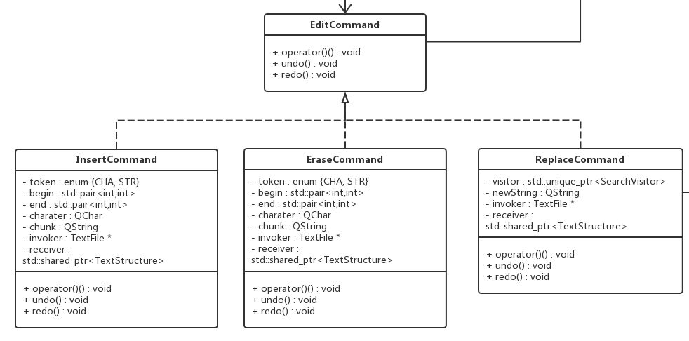

# 数据结构说明和数据字典
概览：

# 1. 基本数据结构

## TextStructure
维护一组TextRow的链表（std::list），是内存中的文本文档的抽象。  

提供对文本文件内容的读取`data()`、插入`insert()`、删除`erase()`，这三个功能各有两个重载函数，一个是对单个字符的操作，另一个是对字符串的操作。  
提供对文本文档内容的逐字符遍历操作`traverse()`。

## TextRow
维护一组字符（QChar）的数组（std::vector），是文本文档中一行字符的抽象。  

提供对一行内容的读取（下标运算符）、插入`insert()`、删除`erase()`操作。其中插入、删除各有两个重载版本，一个处理单个字符，另一个处理字符串。 
提供获取本行长度的操作`size()`。  
提供对一行内容的逐字符遍历操作`traverse()`。

# 2. Visitor继承体系

## [Interface] AbstractVisitor
visitor们的接口，提供公共操作`visit()`，用于访问底层数据结构的每个节点（字符）。

## DisplayVisitor
用于将刚加载到内存中的文件显示在UI界面上。  

维护一个`TextFile`的指针，用于发出更新UI内容的信号。  
维护一个`QString`，用于储存读到的文件中的一行内容。

## SaveVisitor
用于将内存中的数据结构以文本文档(.txt)的形式储存到硬盘中。  

维护一个文件流的引用，用于定位在硬盘中的储存位置。  
维护一个是否输出换行符的标志，用于处理文档末尾的（可能存在的）换行符。

## SearchVisitor
用于完成搜索操作，内部融合了（加强版的）KMP算法。  

提供得到要搜索的模式串的操作`getFormat()`。  
提供获取搜索结果的操作`getResult()`。  
提供判断是否没有找到匹配串的操作`noResult()`。  
私有成员函数`equal()`用于判断两个字符是否相等（依据构造函数中传入的`Qt::CaseSensitivity`类型参数`cs`判断）。  

`target`表示要搜索的模式串，`sensitivity`表示大小写是否敏感，`next`数组辅助KMP算法判断某个字符匹配不成功时的下一个状态。`index`表示当前要匹配的字符对应`next`数组中哪个下标。`row_count`和`column_count`记录当前访问的字符位于第几行第几列。`result`是装着搜索结果的容器。

# 3. Command继承体系

## [Interface] EditCommand
commands的接口，提供公共操作函数调用运算符，撤销/重做造作。

## EraseCommand
删除操作。  
`token`用于判别删除的是字符还是字符串。  
`begin`和`end`用于表示删除操作的起始位置和终止位置（左闭右开的区间）。  
`character`储存要擦除的字符。  
`chunk`储存要擦除的字符串。  
`invoker`用于发出通知UI界面做出更改的信号。  
`receiver`储存要进行操作的底层数据结构。

## InsertCommand
插入操作。  
各成员变量与`EraseCommand`都是对应的。见上。

## ReplaceCommand
替换操作。  
`visitor`中储存着搜索结果和要替换的模式串。  
`newString`是用于替换老串的新串。  
`invoker`用于发出通知UI界面做出更改的信号。  
`receiver`储存要进行操作的底层数据结构。

# 4. Mediator

## Application
支持应用层级的操作，关于文件的操作是由这里提供顶层实现。  

维护一个`TextFile`的列表，表示当前在应用中打开的文件们。  
`current`是指示当前文件的迭代器。  

`addFile()`打开一个新文件，可以是空的，也可以是已经存在的，由参数决定。  
`save()`保存当前文件。  
`saveAs()`另存为。  
`close()`关闭当前文件文件。  
`closeAll()`关闭所文件（退出应用时会调用）。  
`saveAll()`保存所有文件。  
`currentFile()`返回当前文件。  
`setCurrentFile()`设置当前文件。  
`fileLoaded()`文件加载成功的信号。  

## TextFile
表示一个文本文件，对应着一个内存中的底层文档数据结构，也关联着一个硬盘上的文件位置（可能为空）。  
提供执行在单个文件上的编辑操作，包括插入、删除、复制、粘贴、搜索、替换、撤销、重做等。还提供了对单个文件进行保存、关闭的底层操作。  
维护了一个`EditCommand`的列表，用于支持撤销、重做操作。  

>更详细介绍见模块设计说明
